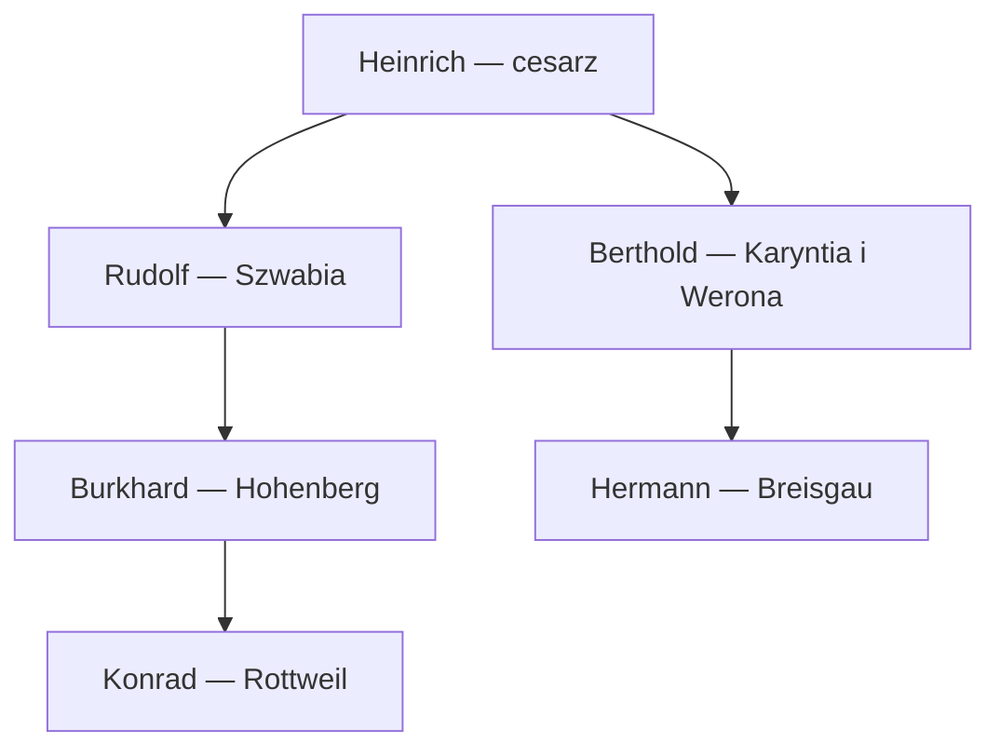

# Szwabia — polityka, zależności i postacie, 18 IX 1066

**Źródło:** `von_Hohenzollern(2).ck3`, SHA-256 `341d67fc3d15b23b3fba2d33e30a8ce2d4b0f822b3b18c465ec2e2c25821b941`; stan **1066-09-18**, CK3 **1.20.0.4**. Alias (1) ma identyczną zawartość. Odczyt wykonano 10 X 2026.

## Zakres i metoda

Ponownie odczytano lokalny oryginał; SHA-256 pozostaje zgodny. ZIP zawiera binarny `gamestate` (73 103 324 B). Rakaly 0.8.21 przekonwertował zapis do tekstu, a kontrola błędów brakujących kluczy zakończyła się poprawnie. Bloki wybierano po ID i równowadze klamer z uwzględnieniem cytowanych ciągów; powtarzane pola spouse zachowano. Oryginał nie został zmieniony.

**112 własnych rekordów** zastępuje etap 20 imion i 30 bezimiennych odniesień. Rodziców ustalono przez odwrotne powiązanie family_data/child w living i dead_unprunable. Domy mapowano przez dynasty_house, obrządki przez rites/database, kultury przez culture_manager/cultures, traity przez traits_lookup tego samego pliku. Brak jawnej kultury pozostawiono NIEUSTALONY.

[Indeks i indywidualne karty](../../02_POSTACIE/indeks_postaci.md) · [Transkrypcja wybranych pól i dowody powiązań](../../06_MATERIALY_ZRODLOWE/notatki_z_wydarzen/polityka_1066-09-18.json).

## Faktyczna władza i granice de iure

**POTWIERDZONE_SAVE:** Burkhard 62634 → Rudolf 33226 → Heinrich 38661. Kontrakt Burkharda 16777216 i senior Hohenbergu wskazują Rudolfa. Kontrakt Rudolfa 8721 wskazuje cesarza.

**Berthold 31865 podlega bezpośrednio cesarzowi**, kontrakt 7697. Posiada księstwa Karyntii (`d_carinthia 1060`) i Werony (`d_verona 2294`), a także Baden. Baden ma seniora de facto Karyntię 1060, de iure Szwabię 1216. Jest to zatem władca odrębnego zespołu ziem wewnątrz Cesarstwa, a nie lennik Rudolfa.

Strzałki pokazują potwierdzoną bezpośrednią zwierzchność kontraktową, nie sojusze.

**POTWIERDZONE_SAVE:** 11 bezpośrednich lenników Rudolfa w bazie kontraktów. Jego obszar faktycznej władzy wykracza poza pierwotny wykaz siedmiu hrabstw de iure.

| Wasal | Własne hrabstwo/baronia | Kontrakt |
|---|---|---:|
| [Burkhard 62634](../../02_POSTACIE/62634/karta.md) | `c_hohenberg 1239`, `b_hohenberg 1240` | 16777216 |
| [Friedrich 32172](../../02_POSTACIE/32172/karta.md) | `c_grunningen 1222`, `b_grunningen 1223` | 7695 |
| [Eberhard 31271](../../02_POSTACIE/31271/karta.md) | `c_furstenberg 1242`, `b_nellenburg 1243` | 7772 |
| [Hupold 30344](../../02_POSTACIE/30344/karta.md) | `c_nordlingen 1157`, `b_nordlingen 1158` | 7912 |
| [Kuno 34995](../../02_POSTACIE/34995/karta.md) | `c_wurttemberg 1227`, `b_wurttemberg 1228` | 8062 |
| [Louis 31737](../../02_POSTACIE/31737/karta.md) | `c_sundgau 1211`, `b_montbelliard 1212`, `b_porrentruy 1215` | 8257 |
| [Egino 37502](../../02_POSTACIE/37502/karta.md) | `c_zollern 1235`, `b_zollern 1236` | 8405 |
| [Welf 34799](../../02_POSTACIE/34799/karta.md) | `c_ravensburg 997`, `b_ravensburg 998` | 8642 |
| [Hartmann 37503](../../02_POSTACIE/37503/karta.md) | `c_zurich 1193`, `b_zurich 1194`, `b_basel 1197` | 9262 |
| [Otto 33227](../../02_POSTACIE/33227/karta.md) | `c_burgau 1000`, `b_burgau 1001`, `b_kirchberg 1002` | 9749 |
| [Ezzo 45250](../../02_POSTACIE/45250/karta.md) | `b_helfenstein 1220` | 16787023 |

Hupold włada Nördlingen, Louis Sundgau, Welf Ravensburgiem, Hartmann Zurychem, Otto Burgau. Nazwy potwierdzono w title_name_data, a zależności oddzielnie w kontraktach. Hrabstwo klucza `c_furstenberg 1242` ma w tym save nazwę **Nellenburg**. Zachowano ID i klucz; nie należy mylić nazwy klucza z nazwą widoczną w zapisie.

Konrad 45254, Ekbert 45251, Friedrich 45252 i Bernhard 45253 mają kontrakty republic_vassal u swoich hrabiów. Ezzo 45250 z Helfensteinu ma kontrakt feudal_vassal bezpośrednio u Rudolfa. Posiadanie baronii nie przesądza rodzaju ustroju. Surowe levels kontraktów zapisano w transkrypcji; bez definicji indeksów nie przypisano im stawek podatku lub poboru.

## Rada księcia i koncentracja urzędów

| Urząd | Osoba | Zadanie |
|---|---|---|
| Kanclerz | [Kuno 34995](../../02_POSTACIE/34995/karta.md) | `task_foreign_affairs` (9878) |
| Zarządca | [Eberhard 31271](../../02_POSTACIE/31271/karta.md) | `task_collect_taxes` (9879) |
| Marszałek | [Hupold 30344](../../02_POSTACIE/30344/karta.md) | `task_organize_levies` (9880) |
| Mistrz intryg | [Friedrich 32172](../../02_POSTACIE/32172/karta.md) | `task_disrupt_schemes` (9881) |
| Duchowny | [Manfred 57580](../../02_POSTACIE/57580/karta.md) | `task_religious_relations` (9882) |
| Małżonek w radzie | [Adelaide 36941](../../02_POSTACIE/36941/karta.md) | `task_spouse_default` (9883) |

**POTWIERDZONE_SAVE:** Friedrich i Hupold występują także na liście knights Rudolfa, obok Ezzo 45250. Berthold jest kanclerzem cesarza (`task_foreign_affairs`, zadanie 4857).

**WNIOSEK:** Rudolf opiera administrację na kilku własnych lennikach. Friedrich łączy domenę, urząd mistrza intryg i wpis rycerski; Berthold ma dostęp do rady cesarskiej poza zwierzchnością Rudolfa. To struktura urzędów, nie dowód lojalności, spisku ani osobistej przewagi.

## Rodziny, sukcesja i powiązania

| Władca | Małżonek główny | Pierwszy wpis sukcesji właściwego tytułu |
|---|---|---|
| [Burkhard 62634](../../02_POSTACIE/62634/karta.md) | brak pola; stan cywilny nieprzesądzony | [Rudolf 33226](../../02_POSTACIE/33226/karta.md) — `c_hohenberg 1239` |
| [Rudolf 33226](../../02_POSTACIE/33226/karta.md) | [Adelaide 36941](../../02_POSTACIE/36941/karta.md) | [Berthold 40517](../../02_POSTACIE/40517/karta.md) — `d_swabia 1216` |
| [Friedrich 32172](../../02_POSTACIE/32172/karta.md) | [Hildegarde 33433](../../02_POSTACIE/33433/karta.md) | [Friedrich 38079](../../02_POSTACIE/38079/karta.md) — `c_grunningen 1222` |
| [Kuno 34995](../../02_POSTACIE/34995/karta.md) | brak pola; stan cywilny nieprzesądzony | [Bruno 40316](../../02_POSTACIE/40316/karta.md) — `c_wurttemberg 1227` |
| [Berthold 31865](../../02_POSTACIE/31865/karta.md) | [Beatrice 36154](../../02_POSTACIE/36154/karta.md) | [Hermann 38078](../../02_POSTACIE/38078/karta.md) — `d_carinthia 1060` |
| [Egino 37502](../../02_POSTACIE/37502/karta.md) | brak pola; stan cywilny nieprzesądzony | [Gebhard 37715](../../02_POSTACIE/37715/karta.md) — `c_zollern 1235` |
| [Eberhard 31271](../../02_POSTACIE/31271/karta.md) | brak pola; stan cywilny nieprzesądzony | [Burkhard 36645](../../02_POSTACIE/36645/karta.md) — `c_furstenberg 1242` |
| [Heinrich 38661](../../02_POSTACIE/38661/karta.md) | [Bertha 38109](../../02_POSTACIE/38109/karta.md) | [Gottfried 29509](../../02_POSTACIE/29509/karta.md) — `e_hre 199` |

**POTWIERDZONE_SAVE / OBLICZONE z odczytanych powiązań:**

- Adelaide 36941, żona Rudolfa (23 lata), i Bertha 38109, żona cesarza (17 lat), mają tych samych rodziców: Adelaide 31430 i Oddon 31456. Są siostrami; Rudolf i Heinrich są powiązani przez małżeństwa z siostrami.
- Mathilda 37235, była żona Rudolfa, i Heinrich 38661 mają tych samych rodziców: Agnes 33238 i Heinrich 31554. Mathilda zmarła 1 I 1060, w wieku 15 lat. Rudolf był wcześniej mężem siostry cesarza.
- Richwara 34471, zmarła żona Bertholda, ma tę samą matkę Adelaide 31430 co Adelaide 36941 i Bertha 38109, lecz innego ojca: Hermann 31144. Jest ich przyrodnią siostrą. Zmarła 1 I 1055, w wieku 22 lat. Obecny główny małżonek Bertholda to Beatrice 36154 (26 lat), córka Louisa 31737 i Sophii 31579.
- Rudolf ma zapisane dzieci: Adelaide 39814 (8), Berthold 40517 (5), Agnes 40849 (3), Bertha 41034 (2). Wszystkie mają również powiązanie matczyne z Adelaide 36941. Bertha 41034 jest zaręczona z Ulrichem 40319; nie są małżeństwem.
- Gebhard 37715 (20) i Kuno 38081 (18) mają wspólnego ojca Egina 29144 z Egino 37502 (21). Gebhard jest pierwszym wskazanym następcą Zollern; nie dopisano wspólnej matki ani pokrewieństwa z graczem.
- Dziedzicem Nellenburgu jest Burkhard 36645 (25), syn Eberharda 31271. To inny Burkhard niż gracz 62634. Starsi synowie Udo 34580 (33) i Ekkehard 34997 (31) nie występują w odczytanej liście sukcesji tego hrabstwa. Udo jest władcą kościelnym, Ekkehard ma trait devoted; dokładnej przyczyny pominięcia nie dopowiedziano.
- Udo 34580 jest też wskazanym head_of_house domu Nellenburg 4138, mimo że jego ojciec Eberhard żyje. Nie utożsamiać ojcostwa, starszeństwa i głowy domu.
- U Bertholda pierwsze czworo dzieci ma potwierdzone powiązanie z Richwarą. Matki Richinzy 39172 (12) nie znaleziono w rejestrach dzieci; nie przypisano jej automatycznie Beatrice ani Richwary.

**WNIOSEK:** sieć tych małżeństw łączy dwór Szwabii, cesarza i rodzinę Bertholda. Samo pokrewieństwo nie tworzy potwierdzonego układu sojuszniczego.

## Roszczenia i elekcja cesarska

**POTWIERDZONE_SAVE:** Hermann 38078 (18), syn Bertholda i hrabia Breisgau, ma roszczenia do `d_swabia 1216`, `d_piedmonte 2311` i `c_turin 2316`. Jego rodzeństwo Luitgard 38251, Berthold 38608 i Gebhard 38908 figuruje również w tablicy claim Szwabii. Hildegarde 33433, żona Friedricha, występuje w tej tablicy. Roszczenia rozpoznanych osób ujęto też w ich kartach.

Berthold ma pressed=yes do Breisgau, posiadanego obecnie przez jego syna Hermanna. Adelaide 36941 i Bertha 38109 mają pressed=yes do Sabaudii, Aosty i Canavese (ID 7568, 7569, 7574, 7582). **WNIOSEK:** istnieją prawne podstawy możliwych sporów o ziemie; save nie dowodzi zamiaru ich realizacji.

**POTWIERDZONE_SAVE:** `e_hre 199` ma prawa male_only_law i princely_elective_succession_law. Zapisane nominacje:

| Elektor | Kandydat | strength nominacji |
|---|---|---:|
| [Heinrich 38661](../../02_POSTACIE/38661/karta.md) | [Gottfried 29509](../../02_POSTACIE/29509/karta.md) | 3 |
| [Heinrich 30634](../../02_POSTACIE/30634/karta.md) | [Reginbodo 32895](../../02_POSTACIE/32895/karta.md) | 1 |
| [Siegfried 34091](../../02_POSTACIE/34091/karta.md) | [Reginbodo 32895](../../02_POSTACIE/32895/karta.md) | 1 |
| [Hermann 32284](../../02_POSTACIE/32284/karta.md) | [Konrad 36457](../../02_POSTACIE/36457/karta.md) | 1 |
| [Vratislav 34285](../../02_POSTACIE/34285/karta.md) | [Vratislav 34285](../../02_POSTACIE/34285/karta.md) | 2 |
| [Ordulf 32387](../../02_POSTACIE/32387/karta.md) | [Lothar-Udo 33042](../../02_POSTACIE/33042/karta.md) | 1 |
| [Udo 34580](../../02_POSTACIE/34580/karta.md) | [Ulrich 31866](../../02_POSTACIE/31866/karta.md) | 1 |
| [Anno 28602](../../02_POSTACIE/28602/karta.md) | [Ordulf 32387](../../02_POSTACIE/32387/karta.md) | 1 |

Udo z Nellenburgu ma tytuły `c_trier 838`, `b_trier 839`, `d_et_trier 17658`, ustrój ecclesiastical_government i jest bezpośrednim kościelnym wasalem cesarza (kontrakt 10237). Jego elektorat i głos na Ulricha 31866 są jawnie zapisane w elekcji. **WNIOSEK:** rodzina Eberharda ma przez Uda obecność w elekcji poza lokalną radą księcia; nie dowodzi to wspólnego głosowania rodziny.

Pierwszy heir cesarstwa to Gottfried 29509, a nie pierwszy wpis osobistego landed_data/succession Heinricha (37899). Nie scalać listy osobistej sukcesji i wyniku elekcji tytułu. Są to wyniki migawki, nie gwarancja późniejszego następstwa.

## Siła, sojusze, wojny i frakcje

| Władca | gold/value | income | current_strength | strength | levy |
|---|---:|---:|---:|---:|---:|
| [Burkhard 62634](../../02_POSTACIE/62634/karta.md) | 66 | 3.42512 | 573 | 773 | 171 |
| [Rudolf 33226](../../02_POSTACIE/33226/karta.md) | 116 | 3.20859 | 625 | 625 | 422 |
| [Berthold 31865](../../02_POSTACIE/31865/karta.md) | 167 | 4.64542 | 1364 | 1364 | 1061 |
| [Friedrich 32172](../../02_POSTACIE/32172/karta.md) | 69 | 1.9074 | 373 | 373 | 171 |
| [Kuno 34995](../../02_POSTACIE/34995/karta.md) | 65 | 1.7983 | 271 | 271 | 171 |
| [Egino 37502](../../02_POSTACIE/37502/karta.md) | 68 | 1.8941 | 374 | 374 | 171 |
| [Eberhard 31271](../../02_POSTACIE/31271/karta.md) | 102 | 2.82325 | 364 | 364 | 163 |
| [Heinrich 38661](../../02_POSTACIE/38661/karta.md) | 1018 | 33.44057 | 2789 | 2789 | 1253 |

Są to dokładne surowe parametry save’a. Nie sumowano ich jako siły koalicji, nie nazwano income dochodem netto ani nie przeliczono strength na gwarantowane wojsko do wojny. **WNIOSEK:** Berthold ma w tej migawce większy current_strength i skarbiec niż Rudolf; do rozstrzygnięcia wojny potrzebne byłyby dalsze dane o wojskach, zobowiązaniach, sojuszach i mobilizacji.

**POTWIERDZONE_ODCZYTEM:** w całym relations/active_relations nie znaleziono wpisu alliances z żadnym z ośmiu głównych władców jako first/second. Ich znalezione relacje zawierają 24 wpisy house_head_hook. Nie rozszerzono tego wyniku na wszystkich 112 rozpoznanych ludzi. Hooków nie nazwano przyjaźnią ani sojuszem.

W wars/active_wars nie znaleziono udziału żadnego z ośmiu głównych władców; w faction_manager/factions nie znaleziono rekordów zawierających ich ID. To brak wskazanych aktywnych wpisów w migawce, nie gwarancja trwałego pokoju, powszechnej lojalności ani braku wszystkich lokalnych problemów.

## Znaczenie dla Burkharda — wnioski

1. **Sukcesja:** Hohenberg wskazuje Rudolfa, typ fallback_default. Kontynuacja władzy przez potomka Burkharda nie jest obecnie zabezpieczona zapisanym wynikiem. Własny family_data Burkharda nie zawiera odczytanych krewnych; nie dopisano autorskiej genealogii.
2. **Zwierzchność:** kluczowe lokalne urzędy Rudolfa są w rękach jego lenników. Kontakty z nimi oznaczają styczność z książęcą administracją, ale nie dają potwierdzenia poparcia dla gracza.
3. **Baden i roszczenia:** Berthold oraz jego syn Hermann są odrębnymi władcami w cesarskiej strukturze. Roszczenie Hermanna do Szwabii jest istotne dla otoczenia seniora Burkharda, lecz nie jest zapowiedzią wojny.
4. **Dwór:** Konrad 45254 łączy Rottweil i urząd zarządcy Burkharda. Gerhard 62635 i Gunzelin 65692 łączą zadania rady z wpisami knights. Sway do Helfericha jest rozpoczętym działaniem, nie potwierdzonym sukcesem.
5. **Szeroki region:** rodziny Nellenburg, Urach, Hohenstaufen oraz domy house_zahringen i house_hupoldinger należy śledzić po ID, z oddzieleniem domu, dynastii, urzędu i kontraktu.

## Pozostałe niewiadome

Nie rozpoznano wyglądu, pełnych efektywnych statystyk, wszystkich opinii, kompletu tajemnic i planów, wszystkich mechanik kontraktów ani całej sukcesji po hipotetycznych zmianach. Rozpoznane 15 modów pozostaje zatwierdzone przez gracza; pięć pozostałych nazw i konkretne wersje nie zostały dopowiedziane. Nie przeniesiono rzeczywistej historii do faktów kampanii.

Ta analiza zastępuje wcześniejszy etap prowizoryczny w tym samym pliku; poprzednie wersje zachowuje historia Git. Data gry nadal wynosi 18 IX 1066.
