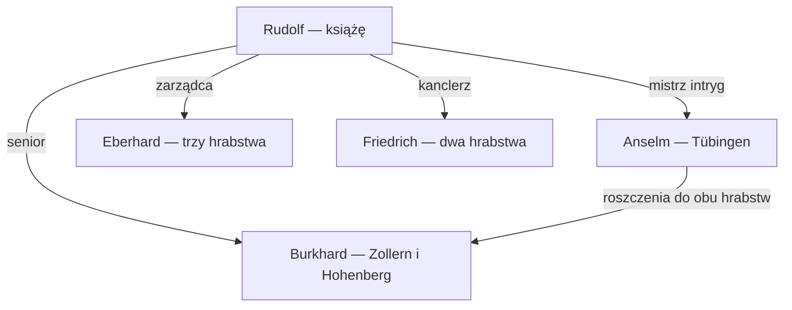

# Polityka Szwabii — 20 IX 1066

## Rzeczywista struktura władzy

POTWIERDZONE_SAVE (S003): Rudolf 33322 posiada d_swabia 1133. Tytuł nie ma `de_facto_liege`, a Rudolf nie występuje jako wasal w odczytanych kontraktach. e_hre 105 oraz k_east_francia 1005 nie mają posiadacza. **W tej kampanii Rudolf jest obecnie samodzielnym księciem de facto.** Nie ustalono przyczyny takiej konfiguracji. De iure i historyczne Cesarstwo nie tworzą czynnego cesarskiego zwierzchnictwa w save’ie. Nie prognozować historii antykróla z 1077 jako wydarzenia tej kampanii.

Burkhard jest jego bezpośrednim wasalem feudalnym, kontrakt 16777216. Sigismund 45347 posiada b_rottweil 1185 i jest republikańskim wasalem Burkharda: nie mylić baronii z hrabstwem ani z kupcem Sigismundem 66605 i kapelanem 58283.

Księstwo obejmuje **22 hrabstwa de facto**, zarządzane przez 17 posiadaczy. De iure Szwabia ma 19 hrabstw: 18 podlega Rudolfowi, natomiast Breisgau należy do Bertholda z Karyntii. Cztery dodatkowe hrabstwa Rudolfa — Grisons, Sankt Gallen, Kyrburg i Zürich — należą de iure do Transjuranii. Zewnętrzny Berthold nie jest dwudziestym trzecim szwabskim wasalem.

## Zasoby wszystkich posiadaczy hrabstw

Wartości są polami zapisanymi w S003, nie oszacowaniem armii po mobilizacji. Dochód nie ma potwierdzenia jako netto. Nie sumować tej tabeli jako wojsk dostępnych księciu: kontrakty, wkład wasali i MIV mogą nakładać wartości.

| Osoba | Hrabstwa | Siła obecna / zapisana | Levy | Złoto | income |
|---|---|---:|---:|---:|---:|
| [Romuald (ID 28761)](postacie/28761.md) | c_sankt_gallen | 568/568 | 58 | 82 | 2.28975 |
| [Hupold (ID 30408)](postacie/30408.md) | c_dillingen | 606/606 | 195 | 61 | 1.69125 |
| [Eberhard (ID 30931)](postacie/30931.md) | c_zurich, c_nellenburg, c_grisons | 1683/1683 | 561 | 160 | 4.431 |
| [Anselm (ID 30932)](postacie/30932.md) | c_tubingen | 590/590 | 178 | 64 | 1.782 |
| [Rudolf (ID 31630)](postacie/31630.md) | c_urach | 490/490 | 178 | 55.58394 | 3.17937 |
| [Friedrich (ID 33142)](postacie/33142.md) | c_staufen, c_nordlingen | 1077/1077 | 365 | 94 | 2.6143 |
| [Hartmann (ID 33143)](postacie/33143.md) | c_kirchberg | 689/689 | 178 | 64 | 1.77375 |
| [Rudolf (ID 33322)](postacie/33322.md) | c_ulm, c_burgau | 1958/1958 | 625 | 202 | 5.61691 |
| [Embricho (ID 33624)](postacie/33624.md) | c_augsburg | 717/717 | 306 | 76 | 2.1075 |
| [Udalrich (ID 34081)](postacie/34081.md) | c_bregenz | 599/599 | 187 | 64 | 1.7864 |
| [Welf (ID 34907)](postacie/34907.md) | c_ravensburg | 792/792 | 179 | 69 | 1.90955 |
| [Kuno (ID 34937)](postacie/34937.md) | c_wurttemberg | 589/589 | 178 | 61 | 1.6995 |
| [Hartmann (ID 37627)](postacie/37627.md) | c_kyrburg | 596/596 | 184 | 64 | 1.782 |
| [Ludwig (ID 38208)](postacie/38208.md) | c_sigmaringen | 790/790 | 178 | 61 | 1.70775 |
| [Berthold (ID 38740)](postacie/38740.md) | c_furstenberg | 491/491 | 178 | 55.72118 | 3.3693 |
| [Manegold (ID 38741)](postacie/38741.md) | c_veringen | 562/562 | 149 | 61.78291 | 3.4699 |
| [Burkhard (ID 62698)](postacie/62698.md) | c_zollern, c_hohenberg | 835/1135 | 333 | 94 | 6.81698 |

Burkhard jest czwarty według current_strength i trzeci według strength w tej grupie; ma najwyższe zapisane income. Eberhard z trzema hrabstwami i urzędem zarządcy ma znacznie większe własne zaplecze wojskowe. Wysokie income Burkharda nie dowodzi najwyższego zysku po kosztach.

## Rada księcia jako sieć wpływu

| Urząd | Osoba | Znaczenie |
|---|---|---|
| Kanclerz | Friedrich 33142 | Dwa hrabstwa, dyplomatyczny dostęp do seniora |
| Zarządca | Eberhard 30931 | Trzy hrabstwa i największa siła spośród wasali-posiadaczy hrabstw |
| Marszałek | Hupold 30408 | Ojciec Hartmanna z Kyrburga, rodzinne zaplecze |
| Mistrz intryg | Anselm 30932 | Roszczenia do obu hrabstw Burkharda |
| Kapelan | Romuald 28761 | Teokratyczne Sankt Gallen, wpływ religijny |
| Małżonka | Adelaide 37062 | Wpis task_spouse_default |

Rudolf ma dwór `court_intrigue`; zapis wielkości dworu current=31, expected=31, base=13. Royal Court for Dukes ma więc widoczny odpowiednik w danych. Burkhard jako hrabia nie ma analogicznego własnego royal court. Wpis `task_debug_unused` nie daje bezpiecznej identyfikacji dodatkowego urzędu.

## Konflikty praw i pokrewieństwo

**Anselm:** połączenie roszczeń do obu ziem Burkharda i urzędu przy księciu jest mocniejszą przesłanką zagrożenia politycznego niż sam zestaw cech. Jego 590 siły jest mniejsze niż 835 Burkharda, ale nie rozstrzyga dostępu do poparcia seniora. Nie znaleziono aktywnego spisku przeciw Burkhardowi w odczytanych strukturach.

**Wolfram 66593:** lokalny pretendent z dworu Burkharda, urząd IDM. To osobne ryzyko negocjacji o prawa do ziemi, nie dowód zdrady. Adalbert 40459 jest kolejnym zapisanym pretendentem do Zollern. Techniczny dawny posiadacz Friedrich 40458 nie staje się automatycznie aktualnym claimantem.

**Ludwig i Manegold:** wzajemne roszczenia do Veringen i Sigmaringen, ta sama dynastia 4264, odmienne domy. Możliwy spór rodzinny, bez potwierdzonej wojny. **Hupold i Hartmann:** ojciec i syn, wspólny dom; urząd marszałka daje kanał wpływu. **Berthold z Fürstenbergu:** syn księcia Karyntii; związki dynastii 4231 łączą też Hupoldingerów. Pokrewieństwo nie jest automatycznie umową o pomocy wojskowej.

**Kuno:** roszczenia do Karyntii, Werony, Padwy i Polesine mogą kierować jego ambicje poza Szwabię. Nie ustalono rozpoczętej wojny. **Eberhard:** zapis relacji sojuszniczej z Arnoldem 33529 poprzez małżeństwo Arnolda i jego córki 34683. Zapisy Anselma z Adelheid 36476 i Berthą 36480 dotyczą małżeństw synów z kobietami bez własnych ziem; nie dopisywać im armii. Rudolf ma scripted friendship z Agnes 33334; przyjaźń nie tworzy cesarskiego zwierzchnictwa.

## Skutki zmian Burkharda

Liutpold 62700, Peter 62703, Gebhard 62702 i Sigismund 45347 mają wobec Burkharda `fired_from_council_opinion`: **−20**, od 18 IX 1066 do 18 IX 1076. Pola value i modify nie sumują się do −40. To modyfikator, a nie końcowa opinia ani dowód buntu. Dawni radni pozostali w otoczeniu, Sigismund zachował ziemię.

Najważniejsze otwarte kwestie: następca i małżeństwo Burkharda, pełne opinie Anselma i czterech dawnych radnych, poparcie kapelana, koszty lokalnych urzędów, dostęp do wsparcia MIV. W odczytanych aktywnych strukturach dla badanego zakresu nie znaleziono wojen, frakcji ani schematów; brak takiego wpisu nie rekonstruuje wcześniejszych wydarzeń.

## Mechaniki a możliwe zamiary

MIV może uzależniać udział wasali od osobowości, relacji i warunków wojny. Włączone lojalistyczne i zdradzieckie mechanizmy nie oznaczają, że doszło do zdrady. Reguły wyłączające wybrane wojny MIV nie zakazują wszystkich wojen gry. MPD wymaga uwzględnienia natężenia cech: nie budować pewnej prognozy z samego słowa wrathful albo ambitious. Immersive Realm Laws pozostawia 14 kluczy prawa; warianty vassal Burkharda odpowiadają bazowym kluczom księcia, co sugeruje wspólne ramy. Bez skryptów nie tłumaczyć numerów na konkretne obowiązki i nie przypisywać ich uchwalenia Burkhardowi.
